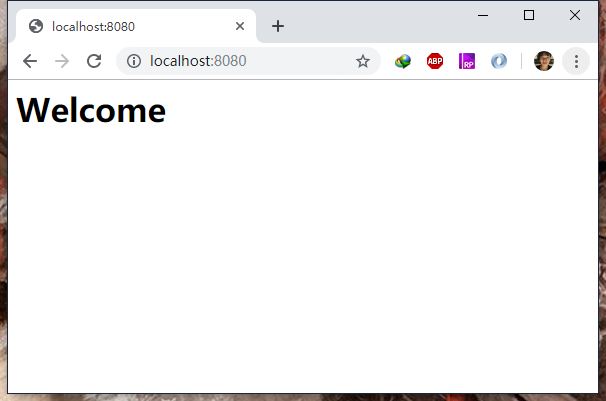

# 从配环境到放弃

***

## 1. Golang 环境安装

Go 的安装还是很简单的，跟安装 python 或者 Node.JS 的开发环境一样，只需要从[官网](https://golang.google.cn/)下载安装包安装好就可以了。不管是 Windows 还是 Mac 都很方便。

## 2. Golang 基本语法学习

总的来说，Golang 的学习难易程度比较低，能很快上手，传说中一个熟练的程序员学习一周左右就能写出比较好的代码了。网上有很多的学习资源，推荐 [Go 语言中文网](https://studygolang.com/)，这是一个 Go 语言中文社区，里面聚集了大量的Go语言爱好者，网站有一个[图书](https://studygolang.com/books)模块，收集了大量的学习资料。想要快速的了解 Go 的特性和语法，可以看看[《通过例子学习 Go》](https://studygolang.com/book/27)。比较权威的书籍是[《The Go Programming Language》](https://studygolang.com/book/29)，本书的中文版是[《Go 语言圣经》](https://studygolang.com/book/42)，翻译的很不错，讲解的也很详细。

## 3. Iris的安装

查阅 [Iris](https://iris-go.com/) 的官网，或者 [Github 地址](https://github.com/kataras/iris)，上面都会有介绍，说安装 Iris 只需要一句命令：`go get -u github.com/kataras/iris`.
ok，在终端中输入这个命令，然后等待、等待、等待...没有反应，最后会等来一个 Git 的报错信息，'unexpected EOF' 之类的，原因是这个命令先从GitHub上把这个包拉下来，再进行安装，但是由于这个包比较大，而且国内网络访问GitHub也有时候不算特别顺畅，执行 `git clone https://github.com/kataras/iris` 也会得到类似的结果。我查阅了多个资料，解决方法无非是要解决网络的问题。

1. 使用 gopm 工具。gopm 是七牛云开发的一个 Go 语言的包管理工具，类似于 python 的 pip，Node.JS 的 npm 和 cnpm。
2. 修改 hosts 文件，具体操作可以参考[相关博客](https://blog.csdn.net/fly_520/article/details/81448930)。
3. 翻墙。我使用的是 SSR，问题就是：终端和 git 不走 sockets 代理，所以又要用相关工具来解决这个问题。
以上三个方法是我在大多数资料中找到的，最终也不算很顺利的安装上了 Iris。公司的 Mac 是通过修改 hosts 做到的，自用的 Windows 是通过翻墙做到的。gopm好像没有很好的效果。

以我的感觉来看，Go 语言在国内还是很火的，那应该对这种问题有很好的解决方案。只是我身边并没有使用 Go 的朋友，所以也不知道在工作中大家是怎么解决的，如果你有很好的方法，请指教一下。

## 4. 测试

在 main.go 文件中输入如下代码：

```Go
package main

import (
    "github.com/kataras/iris"
    "github.com/kataras/iris/middleware/logger"
    "github.com/kataras/iris/middleware/recover"
)
func main() {
    app := iris.New()
    app.Logger().SetLevel("debug")

    app.Use(recover.New()) // 从错误中恢复
    app.Use(logger.New())  // 记录日志
    app.Get("/", func(ctx iris.Context) {
        ctx.HTML("<h1>Welcome</h1>")
    })
    app.Run(iris.Addr(":8080"), iris.WithoutServerError(iris.ErrServerClosed))// 跑起来
}
```

然后在运行 `go run main.go`，这个服务器就跑起来了。
在浏览器中或者postman中访问 `http://localhost:8080/` ，就能看到效果：

